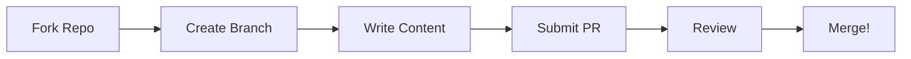

# Contributors

Practical ML Stack is built by practitioners, for practitioners. The use cases and insights come from real people solving real problems in their day jobs.

---

## Our Contributors

<div class="contributor-grid" markdown>

<div class="contributor-card" markdown>


**Your Name Here**

*Data Scientist*

Be the first to contribute!

[:fontawesome-brands-github:](https://github.com/)

</div>

</div>

!!! info "Become a Contributor"
    We're actively looking for practitioners to share their expertise. Your contribution helps thousands of people learn practical ML skills.

---

## How to Contribute

We welcome contributions from ML practitioners at all levels. Here's how you can help:

### :material-file-document-edit: Contribute a Use Case

Share your expertise by writing about a real-world ML problem you've solved.

**What we're looking for:**

- **Industry problems**: Churn, forecasting, fraud, recommendations, etc.
- **Real techniques**: Feature engineering, model selection, deployment strategies
- **Practical insights**: Lessons learned, pitfalls to avoid, business context
- **Reproducible code**: Working examples that readers can run

**Use cases we need:**

| Use Case | Industry | Status |
|----------|----------|--------|
| Fraud Detection | Finance, E-commerce | :material-clock: Needed |
| Customer Segmentation | Marketing, Retail | :material-clock: Needed |
| Predictive Maintenance | Manufacturing, IoT | :material-clock: Needed |
| Credit Scoring | Banking, Lending | :material-clock: Needed |
| Price Optimization | E-commerce, Travel | :material-clock: Needed |
| Demand Forecasting | Retail, Supply Chain | :material-clock: Needed |

### :material-bug: Fix Issues or Improve Content

- Fix typos, improve explanations, or update outdated code
- Add missing details or clarify confusing sections
- Improve code quality or add better examples

### :material-translate: Translate Content

Help make Practical ML Stack accessible to non-English speakers.

---

## Contribution Process



### Step 1: Fork the Repository

```bash
# Fork on GitHub, then clone your fork
git clone https://github.com/YOUR_USERNAME/practical-ml-stack.github.io.git
cd practical-ml-stack.github.io
```

### Step 2: Create a Branch

```bash
git checkout -b add-fraud-detection-usecase
```

### Step 3: Set Up Local Environment

```bash
# Create virtual environment
python -m venv venv
source venv/bin/activate

# Install dependencies
pip install -r requirements.txt

# Start local server
mkdocs serve
```

Visit `http://localhost:8000` to preview your changes.

### Step 4: Write Your Content

For a new use case, create files following this structure:

```
docs/use-cases/your-usecase/
├── index.md        # Problem overview
├── data.md         # Data understanding
├── features.md     # Feature engineering
├── modelling.md    # Model building
└── deployment.md   # Deployment considerations

notebooks/
└── your-usecase.ipynb  # Runnable notebook
```

Use our [Use Case Template](#use-case-template) below.

### Step 5: Create Your Contributor Profile

Create a file at `docs/contributors/profiles/your-name.md`:

```markdown
---
title: Your Name
---

# Your Name


**Role:** Data Scientist at Company Name

**Expertise:** Customer Analytics, Time Series, MLOps

**Contributions:**
- [Fraud Detection](../../use-cases/fraud-detection/index.md)

## About

Brief bio about yourself and your experience with ML.

## Connect

- [:fontawesome-brands-linkedin: LinkedIn](https://linkedin.com/in/yourprofile)
- [:fontawesome-brands-github: GitHub](https://github.com/yourusername)
- [:fontawesome-brands-twitter: Twitter](https://twitter.com/yourhandle)
```

### Step 6: Submit a Pull Request

```bash
git add .
git commit -m "Add fraud detection use case"
git push origin add-fraud-detection-usecase
```

Then open a Pull Request on GitHub.

---

## Use Case Template

Use this template when creating a new use case:

### index.md (Problem Overview)

```markdown
---
title: Use Case Name
description: Brief description for SEO
---

# Use Case Name

[](colab-link)

**One-line problem statement.**

## What is [Problem]?

Explain the business problem.

## Why It Matters

Business impact and value.

## Approach Overview

High-level approach diagram.

## Prerequisites

What readers need to know.

## Datasets

Where to get data.
```

### Content Guidelines

- **Write for practitioners**: Assume Python/ML basics, explain domain specifics
- **Focus on "why"**: Don't just show code—explain the reasoning
- **Use real numbers**: Include actual metrics, business impact
- **Be honest about tradeoffs**: Every decision has pros and cons
- **Test your code**: Everything should run without errors

---

## Recognition

Contributors are recognized in multiple ways:

1. **Contributor page**: Your profile listed on this page
2. **Author attribution**: Your name on every use case you contribute
3. **Social sharing**: We promote contributions on our channels
4. **Community**: Join our contributor community

---

## Code of Conduct

We're committed to providing a welcoming and inclusive environment. All contributors are expected to:

- Be respectful and constructive in feedback
- Welcome newcomers and help them contribute
- Focus on what's best for the community
- Show empathy towards other community members

---

## Questions?

- **GitHub Discussions**: [Ask questions](https://github.com/practical-ml-stack/practical-ml-stack.github.io/discussions)
- **Issues**: [Report problems](https://github.com/practical-ml-stack/practical-ml-stack.github.io/issues)

---

## Ready to Contribute?

<div class="use-case-grid" markdown>

<div class="use-case-card" markdown>

### :material-github: Fork the Repo

Start by forking the repository on GitHub.

[:octicons-arrow-right-24: Fork on GitHub](https://github.com/practical-ml-stack/practical-ml-stack.github.io/fork){ .md-button .md-button--primary }

</div>

<div class="use-case-card" markdown>

### :material-file-document: Use Case Template

Download our template to get started quickly.

[:octicons-arrow-right-24: View Template](#use-case-template){ .md-button }

</div>

</div>
