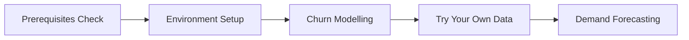

# Getting Started

Welcome to Practical ML Stack! This guide will help you understand what you need to know before diving in, and how to get the most value from this resource.

---

## Prerequisites

Before starting with the use cases, you should be comfortable with:

### :material-language-python: Python Fundamentals

- [ ] Variables, data types, and basic operations
- [ ] Functions and classes
- [ ] List comprehensions and generators
- [ ] File I/O and working with JSON/CSV
- [ ] Virtual environments and pip

!!! tip "Not there yet?"
    We recommend [Python for Everybody](https://www.py4e.com/) or the [Official Python Tutorial](https://docs.python.org/3/tutorial/).

### :material-chart-box: Data Manipulation

- [ ] **pandas**: DataFrames, Series, groupby, merge, pivot
- [ ] **NumPy**: Arrays, broadcasting, basic linear algebra
- [ ] Data cleaning: handling missing values, duplicates, outliers

!!! tip "Not there yet?"
    Try [Kaggle's Pandas Course](https://www.kaggle.com/learn/pandas) (free, ~4 hours).

### :material-brain: Machine Learning Basics

- [ ] Supervised vs unsupervised learning
- [ ] Train/test splits and cross-validation
- [ ] Common algorithms: Linear Regression, Logistic Regression, Decision Trees, Random Forest
- [ ] Evaluation metrics: accuracy, precision, recall, F1, AUC-ROC
- [ ] Basic scikit-learn workflow: fit, predict, score

!!! tip "Not there yet?"
    [Scikit-learn's Getting Started](https://scikit-learn.org/stable/getting_started.html) and [Kaggle's Intro to ML](https://www.kaggle.com/learn/intro-to-machine-learning) are great starting points.

---

## What You Don't Need

Don't worry if you haven't mastered these yet—you'll learn them along the way:

- :material-close: Deep learning frameworks (TensorFlow, PyTorch)
- :material-close: MLOps tools (MLflow, Kubeflow, Airflow)
- :material-close: Cloud platforms (AWS, GCP, Azure)
- :material-close: Advanced statistics or calculus
- :material-close: Software engineering best practices

We'll introduce these concepts as needed in each use case.

---

## How to Use This Resource

### :material-numeric-1-circle: Choose a Use Case

Start with a problem that interests you or relates to your work:

| Use Case | Best For | Difficulty |
|----------|----------|------------|
| [Churn Modelling](../use-cases/churn-modelling/index.md) | Classification, business metrics | :material-star: Beginner-friendly |
| Demand Forecasting | Time series, seasonality | :material-star::material-star: Intermediate |
| Cross-Sell Modelling | Recommendations, ranking | :material-star::material-star: Intermediate |
| Assortment Optimization | Optimization, constraints | :material-star::material-star::material-star: Advanced |

!!! recommendation "First Time Here?"
    Start with **Churn Modelling**. It's our most complete use case and covers the end-to-end ML workflow.

### :material-numeric-2-circle: Read the Concepts

Each use case has multiple pages covering:

1. **Problem Overview** - Business context, why it matters
2. **Data Understanding** - What data you need, where to get it
3. **Feature Engineering** - Creating meaningful features from raw data
4. **Model Building** - Training, tuning, and evaluating models
5. **Deployment** - Taking your model to production

Read through the concepts and code explanations. Understand the *why* behind each decision.

### :material-numeric-3-circle: Run the Code

Every use case includes runnable notebooks:

**Option A: Google Colab** (recommended for beginners)

- Click "Open in Colab" badge
- No setup required—runs in your browser
- Free GPU access for larger models

**Option B: Local Environment**

- Download the notebook
- Follow our [Environment Setup](environment.md) guide
- Run with your own modifications

### :material-numeric-4-circle: Experiment

The real learning happens when you:

- Modify the code and see what changes
- Try different features or algorithms
- Apply the techniques to your own data
- Break things and fix them

---

## Learning Path

### Beginner Path (4-6 weeks)

1. **Week 1**: Review prerequisites, set up environment
2. **Week 2-3**: Complete Churn Modelling use case
3. **Week 4**: Apply to your own dataset
4. **Week 5-6**: Start Demand Forecasting

### Practitioner Path (2-3 weeks)

Already comfortable with ML basics? Jump straight in:

1. **Day 1**: Skim prerequisites, set up environment
2. **Week 1**: Deep dive into most relevant use case
3. **Week 2**: Apply to your work problem
4. **Week 3**: Explore advanced topics (deployment, monitoring)

---

## Getting Help

### :material-github: GitHub Issues

Found a bug or have a suggestion? [Open an issue](https://github.com/practical-ml-stack/practical-ml-stack.github.io/issues).

### :material-forum: Discussions

Have questions or want to share your work? Join the [GitHub Discussions](https://github.com/practical-ml-stack/practical-ml-stack.github.io/discussions).

### :material-account-group: Community

Connect with other practitioners:

- Share your implementations
- Get feedback on your approach
- Learn from others' experiences

---

## Next Steps

### :material-laptop: Set Up Your Environment

Get Python, Jupyter, and essential libraries installed.

[:octicons-arrow-right-24: Environment Setup](environment.md)

### :material-account-cancel: Start Learning

Jump into your first use case with Churn Modelling.

[:octicons-arrow-right-24: Churn Modelling](../use-cases/churn-modelling/index.md)

