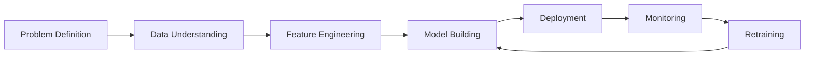

# Deployment

<div class="badge-container" markdown>

[](https://colab.research.google.com/github/practical-ml-stack/practical-ml-stack.github.io/blob/main/notebooks/churn-modelling.ipynb)

</div>

A model in a notebook isn't useful. Let's explore how to deploy your churn model so it can actually impact business decisions.

---

## Deployment Options

Depending on your use case, choose the right deployment pattern:

| Pattern | Use Case | Latency | Complexity |
|---------|----------|---------|------------|
| **Batch Scoring** | Weekly/monthly risk lists | Hours | Low |
| **REST API** | Real-time decisions | Milliseconds | Medium |
| **Streaming** | Real-time event triggers | Milliseconds | High |
| **Embedded** | In-app predictions | Milliseconds | Medium |

For churn prediction, **batch scoring** is usually sufficient—you don't need real-time predictions to send a retention email.

---

## Option 1: Batch Scoring

The simplest approach: score all customers periodically and store results.

### Scoring Script

```python
# score_customers.py
import pandas as pd
import joblib
from datetime import datetime

def load_model_artifacts():
    """Load trained model and preprocessing objects."""
    model = joblib.load('models/churn_model.pkl')
    # Load any other artifacts (scalers, encoders, etc.)
    return model

def extract_features(customer_data: pd.DataFrame) -> pd.DataFrame:
    """Apply feature engineering pipeline."""
    # Import your feature engineering functions
    from features import build_feature_matrix
    return build_feature_matrix(customer_data)

def score_customers(customer_data: pd.DataFrame) -> pd.DataFrame:
    """Score all customers and return risk scores."""
    
    # Load model
    model = load_model_artifacts()
    
    # Engineer features
    features = extract_features(customer_data)
    
    # Generate predictions
    churn_probabilities = model.predict_proba(features)[:, 1]
    
    # Create output dataframe
    results = pd.DataFrame({
        'customer_id': customer_data['customerID'],
        'churn_probability': churn_probabilities,
        'churn_risk_tier': pd.cut(
            churn_probabilities, 
            bins=[0, 0.3, 0.6, 1.0],
            labels=['Low', 'Medium', 'High']
        ),
        'scored_at': datetime.now()
    })
    
    return results.sort_values('churn_probability', ascending=False)

if __name__ == '__main__':
    # Load customer data from your data warehouse
    customers = pd.read_sql(
        "SELECT * FROM customers WHERE is_active = 1",
        connection
    )
    
    # Score
    scores = score_customers(customers)
    
    # Save to database or file
    scores.to_sql('churn_scores', connection, if_exists='replace')
    scores.to_csv(f'scores/churn_scores_{datetime.now().date()}.csv')
    
    print(f"Scored {len(scores)} customers")
    print(f"High risk: {(scores['churn_risk_tier'] == 'High').sum()}")
```

### Scheduling with Cron

```bash
# Run every Monday at 6 AM
0 6 * * 1 /usr/bin/python /path/to/score_customers.py >> /var/log/churn_scoring.log 2>&1
```

### Scheduling with Airflow

```python
# dags/churn_scoring_dag.py
from airflow import DAG
from airflow.operators.python import PythonOperator
from datetime import datetime, timedelta

default_args = {
    'owner': 'data-team',
    'depends_on_past': False,
    'start_date': datetime(2024, 1, 1),
    'retries': 1,
    'retry_delay': timedelta(minutes=5),
}

dag = DAG(
    'churn_scoring',
    default_args=default_args,
    description='Weekly churn scoring pipeline',
    schedule_interval='0 6 * * 1',  # Every Monday at 6 AM
    catchup=False
)

def run_scoring():
    from score_customers import score_customers
    # ... implementation
    
score_task = PythonOperator(
    task_id='score_customers',
    python_callable=run_scoring,
    dag=dag
)
```

---

## Option 2: REST API

For real-time predictions (e.g., during a support call):

### FastAPI Implementation

```python
# api.py
from fastapi import FastAPI, HTTPException
from pydantic import BaseModel
import joblib
import pandas as pd

app = FastAPI(title="Churn Prediction API")

# Load model at startup
model = None

@app.on_event("startup")
def load_model():
    global model
    model = joblib.load('models/churn_model.pkl')

class CustomerFeatures(BaseModel):
    tenure: int
    monthly_charges: float
    total_charges: float
    contract: str  # 'Month-to-month', 'One year', 'Two year'
    payment_method: str
    internet_service: str
    # ... other features

class PredictionResponse(BaseModel):
    customer_id: str
    churn_probability: float
    churn_risk: str
    top_risk_factors: list

@app.post("/predict", response_model=PredictionResponse)
def predict_churn(customer_id: str, features: CustomerFeatures):
    """Predict churn probability for a single customer."""
    
    if model is None:
        raise HTTPException(status_code=500, detail="Model not loaded")
    
    # Convert to DataFrame
    feature_dict = features.dict()
    df = pd.DataFrame([feature_dict])
    
    # Engineer features (simplified)
    X = engineer_features(df)
    
    # Predict
    probability = model.predict_proba(X)[0][1]
    
    # Determine risk tier
    if probability >= 0.6:
        risk = "High"
    elif probability >= 0.3:
        risk = "Medium"
    else:
        risk = "Low"
    
    # Get top risk factors (simplified)
    risk_factors = get_top_risk_factors(model, X, feature_dict)
    
    return PredictionResponse(
        customer_id=customer_id,
        churn_probability=round(probability, 4),
        churn_risk=risk,
        top_risk_factors=risk_factors
    )

@app.get("/health")
def health_check():
    return {"status": "healthy", "model_loaded": model is not None}
```

### Running the API

```bash
# Install dependencies
pip install fastapi uvicorn

# Run server
uvicorn api:app --host 0.0.0.0 --port 8000

# Test
curl -X POST "http://localhost:8000/predict?customer_id=C12345" \
  -H "Content-Type: application/json" \
  -d '{"tenure": 12, "monthly_charges": 75.0, ...}'
```

### Docker Deployment

```dockerfile
# Dockerfile
FROM python:3.10-slim

WORKDIR /app

COPY requirements.txt .
RUN pip install --no-cache-dir -r requirements.txt

COPY models/ models/
COPY api.py .
COPY features.py .

EXPOSE 8000

CMD ["uvicorn", "api:app", "--host", "0.0.0.0", "--port", "8000"]
```

```bash
# Build and run
docker build -t churn-api .
docker run -p 8000:8000 churn-api
```

---

## Model Monitoring

Deployed models can degrade over time. Monitor these metrics:

### 1. Prediction Distribution

```python
# monitoring.py
import pandas as pd
from datetime import datetime, timedelta

def check_prediction_drift(recent_scores: pd.DataFrame, 
                          historical_scores: pd.DataFrame,
                          threshold: float = 0.1):
    """Check if prediction distribution has shifted."""
    
    recent_mean = recent_scores['churn_probability'].mean()
    historical_mean = historical_scores['churn_probability'].mean()
    
    drift = abs(recent_mean - historical_mean)
    
    if drift > threshold:
        alert(f"Prediction drift detected: {drift:.3f}")
        return True
    return False

def check_feature_drift(recent_data: pd.DataFrame,
                       historical_data: pd.DataFrame,
                       features: list):
    """Check if input features have shifted."""
    
    drifted_features = []
    for feature in features:
        recent_mean = recent_data[feature].mean()
        historical_mean = historical_data[feature].mean()
        
        # Simple check - could use more sophisticated tests
        if abs(recent_mean - historical_mean) / (historical_mean + 1e-10) > 0.2:
            drifted_features.append(feature)
    
    if drifted_features:
        alert(f"Feature drift detected: {drifted_features}")
    
    return drifted_features
```

### 2. Model Performance (When Labels Arrive)

```python
def evaluate_model_performance(predictions: pd.DataFrame,
                              actuals: pd.DataFrame,
                              threshold: float = 0.05):
    """Evaluate model against actual outcomes."""
    
    # Merge predictions with actual churn
    merged = predictions.merge(actuals, on='customer_id')
    
    # Calculate metrics
    from sklearn.metrics import roc_auc_score, precision_score, recall_score
    
    auc = roc_auc_score(merged['actual_churn'], merged['churn_probability'])
    
    # Compare to baseline
    baseline_auc = 0.85  # From training
    
    if auc < baseline_auc - threshold:
        alert(f"Model performance degraded: AUC {auc:.3f} vs baseline {baseline_auc:.3f}")
        return False
    
    return True
```

### 3. Dashboard Metrics

Track these metrics on a dashboard:

| Metric | Description | Alert Threshold |
|--------|-------------|-----------------|
| **Prediction Volume** | Scores generated per day | <90% of expected |
| **Mean Probability** | Average churn score | >20% change from baseline |
| **High Risk Count** | Customers in high risk tier | >50% change week-over-week |
| **Model Latency** | API response time (P95) | >500ms |
| **Error Rate** | Failed predictions | >1% |

---

## Retraining Strategy

### When to Retrain

1. **Scheduled**: Monthly or quarterly regardless of performance
2. **Performance-triggered**: When metrics drop below threshold
3. **Data-triggered**: When significant data drift is detected

### Retraining Pipeline

```python
# retrain_pipeline.py
from sklearn.model_selection import train_test_split
from datetime import datetime
import mlflow

def retrain_model(training_data: pd.DataFrame):
    """Retrain churn model with new data."""
    
    # Start MLflow run
    with mlflow.start_run(run_name=f"retrain_{datetime.now().date()}"):
        
        # Prepare data
        X = build_feature_matrix(training_data)
        y = training_data['churned']
        
        X_train, X_test, y_train, y_test = train_test_split(
            X, y, test_size=0.2, stratify=y
        )
        
        # Train model (same hyperparameters or re-tune)
        model = XGBClassifier(**best_params)
        model.fit(X_train, y_train)
        
        # Evaluate
        y_prob = model.predict_proba(X_test)[:, 1]
        auc = roc_auc_score(y_test, y_prob)
        
        # Log metrics
        mlflow.log_metric("roc_auc", auc)
        mlflow.log_params(best_params)
        
        # Compare to production model
        prod_auc = get_production_model_auc()
        
        if auc > prod_auc:
            # New model is better - promote to production
            mlflow.sklearn.log_model(model, "model")
            promote_to_production(model)
            print(f"New model promoted: AUC {auc:.3f} > {prod_auc:.3f}")
        else:
            print(f"Keeping current model: {prod_auc:.3f} >= {auc:.3f}")
```

---

## Integration with Business Processes

The model is only valuable if it drives action:

### 1. CRM Integration

```python
# Push scores to Salesforce/HubSpot
def update_crm_scores(scores: pd.DataFrame):
    """Update customer churn scores in CRM."""
    
    for _, row in scores.iterrows():
        crm_client.update_contact(
            customer_id=row['customer_id'],
            fields={
                'churn_risk_score': row['churn_probability'],
                'churn_risk_tier': row['churn_risk_tier'],
                'scored_date': row['scored_at']
            }
        )
```

### 2. Automated Campaigns

```python
# Trigger retention campaigns
def trigger_retention_campaigns(scores: pd.DataFrame):
    """Trigger automated retention actions based on risk."""
    
    high_risk = scores[scores['churn_risk_tier'] == 'High']
    
    for _, customer in high_risk.iterrows():
        # Add to retention campaign
        marketing_platform.add_to_campaign(
            customer_id=customer['customer_id'],
            campaign='high_risk_retention',
            priority=customer['churn_probability']
        )
        
        # Create task for account manager
        crm_client.create_task(
            assigned_to=get_account_manager(customer['customer_id']),
            subject=f"High churn risk: {customer['customer_id']}",
            due_date=datetime.now() + timedelta(days=3)
        )
```

### 3. Reporting Dashboard

Provide stakeholders with actionable insights:

- Weekly risk summary
- Trend analysis
- Campaign effectiveness
- Model performance metrics

---

## Production Checklist

Before deploying to production:

- [ ] **Model validation**: Tested on holdout data
- [ ] **Code review**: Scoring code reviewed by peer
- [ ] **Integration tests**: End-to-end pipeline tested
- [ ] **Monitoring**: Alerts configured for drift/errors
- [ ] **Documentation**: API docs, runbooks
- [ ] **Rollback plan**: Can revert to previous model
- [ ] **Access control**: Appropriate permissions set
- [ ] **Logging**: Predictions logged for audit
- [ ] **Business sign-off**: Stakeholders approved

---

## Summary

You've completed the full churn modeling journey:



### Key Achievements

- [x] Defined the business problem and success metrics
- [x] Explored and cleaned the data
- [x] Engineered 38 predictive features
- [x] Trained and compared multiple models
- [x] Achieved 0.856 ROC-AUC with XGBoost
- [x] Optimized threshold for business constraints
- [x] Learned deployment patterns and monitoring

---

## Next Steps

<div class="use-case-grid" markdown>

<div class="use-case-card" markdown>

### :material-download: Get the Complete Code

Download the Jupyter notebook with all code from this use case.

[](https://colab.research.google.com/github/practical-ml-stack/practical-ml-stack.github.io/blob/main/notebooks/churn-modelling.ipynb)

</div>

<div class="use-case-card" markdown>

### :material-head-question: Try Another Use Case

Apply what you've learned to a different problem.

[:octicons-arrow-right-24: Browse Use Cases](../index.md)

</div>

</div>

---

## Want to Contribute?

Have you built a churn model at your company? Share your learnings!

[:material-account-group: Become a Contributor](../../contributors/index.md){ .md-button }
