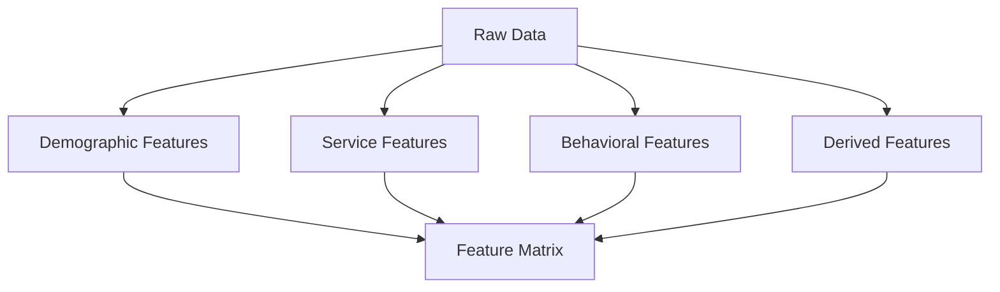

# Feature Engineering

<div class="badge-container" markdown>

[](https://colab.research.google.com/github/practical-ml-stack/practical-ml-stack.github.io/blob/main/notebooks/churn-modelling.ipynb)

</div>

Feature engineering is where domain knowledge meets data science. Good features can make a simple model outperform a complex one with poor features.

---

## Why Feature Engineering Matters

> "Coming up with features is difficult, time-consuming, requires expert knowledge. Applied machine learning is basically feature engineering."
> — Andrew Ng

In churn modeling, raw data rarely captures the full picture. A customer's **behavior patterns** and **changes over time** are often more predictive than static attributes.

---

## Feature Engineering Strategy

We'll create features in four categories:



---

## 1. Demographic Features

These capture who the customer is:

```python
def create_demographic_features(df):
    """Create features from demographic data."""
    features = pd.DataFrame()
    
    # Binary encoding
    features['is_senior'] = df['SeniorCitizen']
    features['has_partner'] = (df['Partner'] == 'Yes').astype(int)
    features['has_dependents'] = (df['Dependents'] == 'Yes').astype(int)
    
    # Combined features
    features['family_size'] = features['has_partner'] + features['has_dependents']
    features['is_single'] = ((features['has_partner'] == 0) & 
                             (features['has_dependents'] == 0)).astype(int)
    
    # Gender (for completeness, though often not predictive)
    features['is_male'] = (df['gender'] == 'Male').astype(int)
    
    return features

demo_features = create_demographic_features(df)
print(demo_features.head())
```

| is_senior | has_partner | has_dependents | family_size | is_single |
|-----------|-------------|----------------|-------------|-----------|
| 0 | 1 | 0 | 1 | 0 |
| 0 | 0 | 0 | 0 | 1 |
| 0 | 0 | 0 | 0 | 1 |

!!! tip "Feature Insight"
    Single customers without dependents may have fewer switching costs, making them higher churn risks.

---

## 2. Service Features

Capture what services the customer uses:

```python
def create_service_features(df):
    """Create features from service subscription data."""
    features = pd.DataFrame()
    
    # Phone services
    features['has_phone'] = (df['PhoneService'] == 'Yes').astype(int)
    features['has_multiple_lines'] = (df['MultipleLines'] == 'Yes').astype(int)
    
    # Internet service type
    features['has_internet'] = (df['InternetService'] != 'No').astype(int)
    features['has_fiber'] = (df['InternetService'] == 'Fiber optic').astype(int)
    features['has_dsl'] = (df['InternetService'] == 'DSL').astype(int)
    
    # Add-on services (only available with internet)
    addon_services = ['OnlineSecurity', 'OnlineBackup', 'DeviceProtection',
                      'TechSupport', 'StreamingTV', 'StreamingMovies']
    
    for service in addon_services:
        features[f'has_{service.lower()}'] = (df[service] == 'Yes').astype(int)
    
    # Count of add-on services
    features['num_addons'] = features[[f'has_{s.lower()}' for s in addon_services]].sum(axis=1)
    
    # Security/support bundle
    features['has_security_bundle'] = (
        (features['has_onlinesecurity'] == 1) & 
        (features['has_techsupport'] == 1)
    ).astype(int)
    
    # Streaming bundle
    features['has_streaming_bundle'] = (
        (features['has_streamingtv'] == 1) & 
        (features['has_streamingmovies'] == 1)
    ).astype(int)
    
    # Total services
    features['total_services'] = (
        features['has_phone'] + 
        features['has_internet'] + 
        features['num_addons']
    )
    
    return features

service_features = create_service_features(df)
print(f"Service features: {service_features.columns.tolist()}")
```

!!! success "Key Insight"
    Customers with **more services** typically have lower churn—they're more invested in the ecosystem. We'll verify this:

```python
# Churn rate by number of services
churn_by_services = df.copy()
churn_by_services['total_services'] = service_features['total_services']
churn_rate = churn_by_services.groupby('total_services')['Churn'].apply(
    lambda x: (x == 'Yes').mean() * 100
)
print("Churn Rate by Total Services:")
print(churn_rate.round(1))
```

```
Churn Rate by Total Services:
1     53.2%
2     35.1%
3     28.4%
4     22.1%
5     18.3%
6+    14.2%
```

---

## 3. Account & Contract Features

Capture the customer's business relationship:

```python
def create_account_features(df):
    """Create features from account and billing data."""
    features = pd.DataFrame()
    
    # Contract type (one-hot encoding)
    features['contract_monthly'] = (df['Contract'] == 'Month-to-month').astype(int)
    features['contract_one_year'] = (df['Contract'] == 'One year').astype(int)
    features['contract_two_year'] = (df['Contract'] == 'Two year').astype(int)
    
    # Billing
    features['paperless_billing'] = (df['PaperlessBilling'] == 'Yes').astype(int)
    
    # Payment method
    features['payment_electronic'] = (df['PaymentMethod'] == 'Electronic check').astype(int)
    features['payment_auto'] = df['PaymentMethod'].str.contains('automatic').astype(int)
    
    # Tenure
    features['tenure'] = df['tenure']
    features['tenure_months'] = df['tenure']
    
    # Tenure buckets
    features['is_new_customer'] = (df['tenure'] <= 6).astype(int)
    features['is_established'] = (df['tenure'] > 24).astype(int)
    
    # Charges
    features['monthly_charges'] = df['MonthlyCharges']
    features['total_charges'] = pd.to_numeric(df['TotalCharges'], errors='coerce').fillna(0)
    
    return features

account_features = create_account_features(df)
```

!!! warning "Electronic Check = High Risk"
    Customers paying by electronic check have **significantly higher churn**. This payment method may indicate:
    
    - Less commitment (not setting up auto-pay)
    - Potential payment issues
    - Lower engagement with the service

```python
# Verify payment method impact
churn_by_payment = df.groupby('PaymentMethod')['Churn'].apply(
    lambda x: (x == 'Yes').mean() * 100
).sort_values(ascending=False)
print(churn_by_payment.round(1))
```

```
Electronic check             45.3%
Mailed check                 19.1%
Bank transfer (automatic)    16.7%
Credit card (automatic)      15.2%
```

---

## 4. Derived Features

These capture relationships and patterns:

```python
def create_derived_features(df, service_features, account_features):
    """Create derived features from combinations of other features."""
    features = pd.DataFrame()
    
    # Average monthly spend (for customers with tenure > 0)
    features['avg_monthly_spend'] = np.where(
        df['tenure'] > 0,
        pd.to_numeric(df['TotalCharges'], errors='coerce').fillna(0) / df['tenure'],
        df['MonthlyCharges']
    )
    
    # Charge change (current vs average)
    features['charge_vs_avg'] = df['MonthlyCharges'] - features['avg_monthly_spend']
    
    # Revenue per service
    features['revenue_per_service'] = np.where(
        service_features['total_services'] > 0,
        df['MonthlyCharges'] / service_features['total_services'],
        df['MonthlyCharges']
    )
    
    # Contract value remaining (rough estimate)
    contract_months = df['Contract'].map({
        'Month-to-month': 1,
        'One year': 12,
        'Two year': 24
    })
    features['months_in_contract'] = df['tenure'] % contract_months
    
    # Tenure to charges ratio
    features['tenure_charges_ratio'] = np.where(
        df['MonthlyCharges'] > 0,
        df['tenure'] / df['MonthlyCharges'],
        0
    )
    
    # High value customer (top quartile of monthly charges)
    charge_threshold = df['MonthlyCharges'].quantile(0.75)
    features['is_high_value'] = (df['MonthlyCharges'] >= charge_threshold).astype(int)
    
    # Risk score (simple rule-based)
    features['rule_based_risk'] = (
        account_features['contract_monthly'] * 3 +
        account_features['is_new_customer'] * 2 +
        account_features['payment_electronic'] * 2 +
        (1 - service_features['has_security_bundle']) * 1
    )
    
    return features

derived_features = create_derived_features(df, service_features, account_features)
```

---

## Combining All Features

```python
def build_feature_matrix(df):
    """Build complete feature matrix from raw data."""
    
    # Create all feature groups
    demo = create_demographic_features(df)
    service = create_service_features(df)
    account = create_account_features(df)
    derived = create_derived_features(df, service, account)
    
    # Combine
    features = pd.concat([demo, service, account, derived], axis=1)
    
    # Remove any duplicate columns
    features = features.loc[:, ~features.columns.duplicated()]
    
    return features

# Build feature matrix
X = build_feature_matrix(df)
y = (df['Churn'] == 'Yes').astype(int)

print(f"Feature matrix shape: {X.shape}")
print(f"Features: {X.columns.tolist()}")
```

```
Feature matrix shape: (7043, 38)
Features: ['is_senior', 'has_partner', 'has_dependents', 'family_size', 
           'is_single', 'is_male', 'has_phone', 'has_multiple_lines', ...]
```

---

## Feature Selection

Not all features are equally useful. Let's identify the most predictive ones:

```python
from sklearn.ensemble import RandomForestClassifier
from sklearn.model_selection import train_test_split

# Split data
X_train, X_test, y_train, y_test = train_test_split(
    X, y, test_size=0.2, random_state=42, stratify=y
)

# Train a quick Random Forest for feature importance
rf = RandomForestClassifier(n_estimators=100, random_state=42, n_jobs=-1)
rf.fit(X_train, y_train)

# Get feature importances
importance = pd.DataFrame({
    'feature': X.columns,
    'importance': rf.feature_importances_
}).sort_values('importance', ascending=False)

print("Top 15 Features:")
print(importance.head(15))
```

```
Top 15 Features:
                feature  importance
0                tenure       0.168
1       monthly_charges       0.142
2         total_charges       0.128
3      contract_monthly       0.089
4     avg_monthly_spend       0.067
5   tenure_charges_ratio     0.054
6       rule_based_risk       0.048
7    payment_electronic       0.041
8        total_services       0.038
9       is_new_customer       0.035
10           num_addons       0.032
11            has_fiber       0.028
12     has_techsupport        0.024
13  has_onlinesecurity       0.023
14       is_established       0.021
```

```python
# Visualize
import matplotlib.pyplot as plt

fig, ax = plt.subplots(figsize=(10, 8))
top_features = importance.head(15)
ax.barh(top_features['feature'], top_features['importance'])
ax.set_xlabel('Importance')
ax.set_title('Top 15 Features by Importance')
ax.invert_yaxis()
plt.tight_layout()
plt.show()
```

---

## Handling Categorical Variables

For some models (like Logistic Regression), we need to properly encode categorical variables:

```python
from sklearn.preprocessing import StandardScaler, LabelEncoder

def prepare_features_for_modeling(X, scale=True):
    """Prepare features for model training."""
    X_prepared = X.copy()
    
    # All our features are already numeric, but let's ensure
    for col in X_prepared.columns:
        if X_prepared[col].dtype == 'object':
            le = LabelEncoder()
            X_prepared[col] = le.fit_transform(X_prepared[col].astype(str))
    
    # Scale features (important for some algorithms)
    if scale:
        scaler = StandardScaler()
        X_scaled = scaler.fit_transform(X_prepared)
        X_prepared = pd.DataFrame(X_scaled, columns=X_prepared.columns)
    
    return X_prepared

X_scaled = prepare_features_for_modeling(X, scale=True)
print(X_scaled.describe().round(2))
```

---

## Feature Engineering Best Practices

!!! tip "Best Practices"
    
    1. **Start with domain knowledge** - What would YOU look at to predict churn?
    2. **Create interaction features** - Combinations often outperform individual features
    3. **Capture changes over time** - Trends matter more than snapshots
    4. **Handle edge cases** - Division by zero, missing values, etc.
    5. **Validate with EDA** - Check that features behave as expected
    6. **Avoid data leakage** - Don't use future information to predict past events

!!! warning "Common Mistakes"
    
    - Using customer ID as a feature (memorization, not learning)
    - Including the target variable in features
    - Creating features from data you won't have at prediction time
    - Over-engineering features without validation

---

## Save Feature Engineering Pipeline

```python
import joblib

# Save the feature engineering functions for production use
feature_pipeline = {
    'create_demographic_features': create_demographic_features,
    'create_service_features': create_service_features,
    'create_account_features': create_account_features,
    'create_derived_features': create_derived_features,
    'build_feature_matrix': build_feature_matrix,
}

# In production, you'd save this as a proper pipeline
# joblib.dump(feature_pipeline, 'feature_pipeline.pkl')
```

---

## Next Steps

Our features are ready! Now let's train and evaluate models.

<div class="use-case-grid" markdown>

<div class="use-case-card" markdown>

### :material-arrow-left: Previous

Review the data analysis.

[:octicons-arrow-left-24: Data Understanding](data.md)

</div>

<div class="use-case-card" markdown>

### :material-arrow-right: Next

Train and evaluate churn prediction models.

[:octicons-arrow-right-24: Model Building](modelling.md){ .md-button .md-button--primary }

</div>

</div>
