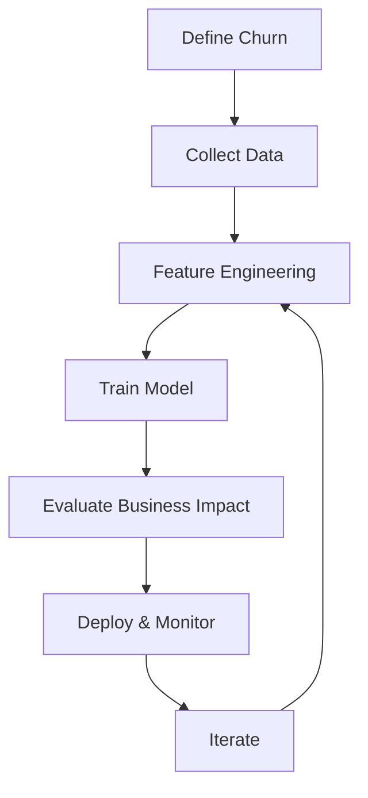

# Churn Modelling

<div class="badge-container" markdown>

[](https://colab.research.google.com/github/practical-ml-stack/practical-ml-stack.github.io/blob/main/notebooks/churn-modelling.ipynb)
[](../../notebooks/churn-modelling.ipynb)

</div>

**Predict which customers will leave before they do.**

Customer churn prediction is one of the most valuable applications of machine learning in business. A well-built churn model can save millions by enabling proactive retention strategies.

---

## What is Churn?

**Churn** (also called attrition) occurs when a customer stops doing business with you. Depending on your business model:

| Business Type | Churn Definition |
|---------------|------------------|
| **Subscription** (SaaS, Telecom) | Customer cancels subscription |
| **Contractual** (Banking, Insurance) | Customer doesn't renew contract |
| **Non-contractual** (Retail, E-commerce) | Customer stops purchasing (requires definition) |

!!! note "The Non-Contractual Challenge"
    In non-contractual businesses, there's no explicit "cancellation" event. You must define churn based on behavior—e.g., "no purchase in 90 days." This definition significantly impacts your model.

---

## Why Churn Prediction Matters

### The Business Case

Consider these typical numbers:

- **Acquiring a new customer costs 5-25x more** than retaining an existing one
- **A 5% increase in retention** can increase profits by 25-95%
- **Churned customers rarely come back** - win-back rates are typically <10%

### What You Can Do With a Churn Model

1. **Proactive Retention** - Reach out to at-risk customers before they leave
2. **Resource Allocation** - Focus retention budget on customers most likely to churn
3. **Root Cause Analysis** - Understand why customers leave
4. **Product Improvement** - Identify features/issues driving churn
5. **Customer Lifetime Value** - Better predict long-term value

---

## The Business Problem

!!! example "Scenario: Telecom Company"
    You're a data scientist at a telecom company. The VP of Customer Success comes to you:
    
    *"We're losing customers faster than we can acquire them. Last quarter, 2,500 customers churned—that's $3M in annual recurring revenue lost. We have a retention team, but they're calling customers randomly. Can you help us identify who's about to leave so we can intervene?"*

### Success Metrics

Before building any model, define success:

| Metric | Definition | Target |
|--------|------------|--------|
| **Precision** | Of predicted churners, how many actually churn? | >70% |
| **Recall** | Of actual churners, how many did we catch? | >60% |
| **Lift** | How much better than random targeting? | >3x |
| **Business Impact** | Revenue saved through retention | >$500K/quarter |

!!! warning "Precision vs Recall Trade-off"
    - **High Precision**: Fewer false alarms, but miss some churners
    - **High Recall**: Catch more churners, but waste resources on non-churners
    
    The right balance depends on your retention capacity and intervention cost.

---

## Approach Overview



### What We'll Cover

| Section | Description | Time |
|---------|-------------|------|
| [Data Understanding](data.md) | What data you need, EDA, data quality | 45 min |
| [Feature Engineering](features.md) | Creating predictive features from raw data | 60 min |
| [Model Building](modelling.md) | Training, tuning, and evaluation | 90 min |
| [Deployment](deployment.md) | Taking your model to production | 45 min |

---

## Quick Preview: What You'll Build

By the end of this use case, you'll have:

```python
# Load your trained model
import joblib
model = joblib.load('churn_model.pkl')

# Score a customer
customer_features = extract_features(customer_id='C12345')
churn_probability = model.predict_proba(customer_features)[0][1]

print(f"Churn Risk: {churn_probability:.1%}")
# Output: Churn Risk: 73.2%

# Get top risk factors
explain_prediction(model, customer_features)
# Output: 
# - Contract: Month-to-month (+15% risk)
# - Tenure: 3 months (+12% risk)
# - Support tickets: 5 in last month (+10% risk)
```

---

## Prerequisites

Before starting, make sure you're comfortable with:

- [x] Python basics (functions, classes, data structures)
- [x] pandas (DataFrames, groupby, merge)
- [x] scikit-learn basics (fit, predict, train_test_split)
- [x] Basic statistics (mean, median, correlation)

Not there yet? Check our [Getting Started](../../getting-started/index.md) guide.

---

## Datasets

We'll use the **Telco Customer Churn** dataset, a classic dataset for learning churn modeling:

| Source | Rows | Features | Link |
|--------|------|----------|------|
| Kaggle | 7,043 | 21 | [Download](https://www.kaggle.com/datasets/blastchar/telco-customer-churn) |
| IBM Sample | 7,043 | 21 | [Download](https://community.ibm.com/community/user/businessanalytics/blogs/steven-macko/2019/07/11/telco-customer-churn-1113) |

For practice with larger data, try:

| Dataset | Rows | Description |
|---------|------|-------------|
| [KKBox Churn](https://www.kaggle.com/c/kkbox-churn-prediction-challenge) | 2.6M | Music streaming service |
| [Santander](https://www.kaggle.com/c/santander-customer-satisfaction) | 76K | Banking |

---

## Ready to Start?

<div class="use-case-grid" markdown>

<div class="use-case-card" markdown>

### :material-numeric-1-circle: Data Understanding

Explore the data, understand distributions, and identify quality issues.

[:octicons-arrow-right-24: Start Here](data.md){ .md-button .md-button--primary }

</div>

<div class="use-case-card" markdown>

### :material-download: Get the Notebook

Run the complete analysis in Google Colab or download to run locally.

[](https://colab.research.google.com/github/practical-ml-stack/practical-ml-stack.github.io/blob/main/notebooks/churn-modelling.ipynb)

</div>

</div>
