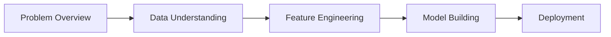

# Use Cases

Real-world machine learning problems solved end-to-end. Each use case covers the complete journey from business problem to production deployment.

---

## Available Use Cases

### :material-account-cancel: Churn Modelling

**Predict which customers will leave before they do.**

Churn prediction is one of the most impactful ML applications in business. Learn to build models that identify at-risk customers, enabling proactive retention strategies.

| Aspect | Details |
|--------|---------|
| **Industry** | Telecom, SaaS, Banking, Retail |
| **Problem Type** | Binary Classification |
| **Difficulty** | :material-star: Beginner-friendly |
| **Time to Complete** | 4-6 hours |

**You'll Learn:**

- Feature engineering for behavioral data
- Handling class imbalance
- Model interpretability for stakeholders
- Business metrics (CLV, retention cost)

[:octicons-arrow-right-24: Start Churn Modelling](churn-modelling/index.md){ .md-button .md-button--primary }

### :material-chart-timeline-variant: Demand Forecasting

**Predict future demand to optimize inventory and resources.**

Time series forecasting for retail, supply chain, and resource planning. Handle seasonality, promotions, and external factors.

| Aspect | Details |
|--------|---------|
| **Industry** | Retail, Manufacturing, Logistics |
| **Problem Type** | Time Series Regression |
| **Difficulty** | :material-star::material-star: Intermediate |
| **Time to Complete** | 6-8 hours |

**You'll Learn:**

- Time series feature engineering
- Handling seasonality and trends
- Promotional impact modeling
- Forecast accuracy metrics (MAPE, WMAPE)

[:octicons-arrow-right-24: Coming Soon](#){ .md-button }

### :material-cart-plus: Cross-Sell Modelling

**Recommend the right product to the right customer.**

Build recommendation systems that drive revenue without annoying customers. Balance personalization with business constraints.

| Aspect | Details |
|--------|---------|
| **Industry** | Banking, Insurance, E-commerce |
| **Problem Type** | Multi-class Classification / Ranking |
| **Difficulty** | :material-star::material-star: Intermediate |
| **Time to Complete** | 6-8 hours |

**You'll Learn:**

- Propensity modeling
- Next-best-action frameworks
- A/B testing recommendations
- Uplift modeling basics

[:octicons-arrow-right-24: Coming Soon](#){ .md-button }

### :material-store: Assortment Optimization

**Decide which products to stock in which locations.**

Combine ML predictions with optimization to maximize profit under real-world constraints like shelf space and supplier agreements.

| Aspect | Details |
|--------|---------|
| **Industry** | Retail, CPG, Grocery |
| **Problem Type** | Optimization + ML |
| **Difficulty** | :material-star::material-star::material-star: Advanced |
| **Time to Complete** | 8-10 hours |

**You'll Learn:**

- Demand prediction at SKU-store level
- Mathematical optimization basics
- Constraint handling
- What-if scenario analysis

[:octicons-arrow-right-24: Coming Soon](#){ .md-button }

### :material-map-marker-path: Beat Planning

**Optimize sales routes and territory assignments.**

Help field sales teams cover more ground efficiently. Balance workload, travel time, and customer coverage.

| Aspect | Details |
|--------|---------|
| **Industry** | FMCG, Pharma, Field Services |
| **Problem Type** | Optimization + Clustering |
| **Difficulty** | :material-star::material-star::material-star: Advanced |
| **Time to Complete** | 8-10 hours |

**You'll Learn:**

- Geospatial clustering
- Vehicle routing problems (VRP)
- Workload balancing
- Territory optimization

[:octicons-arrow-right-24: Coming Soon](#){ .md-button }

### :material-currency-usd: Price Optimization

**Set optimal prices to maximize revenue or profit.**

Dynamic pricing strategies using demand elasticity modeling. Balance short-term revenue with long-term customer relationships.

| Aspect | Details |
|--------|---------|
| **Industry** | E-commerce, Airlines, Hotels |
| **Problem Type** | Regression + Optimization |
| **Difficulty** | :material-star::material-star::material-star: Advanced |
| **Time to Complete** | 8-10 hours |

**You'll Learn:**

- Price elasticity modeling
- Competitive pricing analysis
- A/B testing for pricing
- Revenue management basics

[:octicons-arrow-right-24: Coming Soon](#){ .md-button }

---

## Use Case Structure

Every use case follows a consistent structure:

### 1. Problem Overview

- Business context and why it matters
- Success metrics and KPIs
- Common pitfalls and challenges

### 2. Data Understanding

- What data you need
- Where to find similar datasets
- Exploratory data analysis

### 3. Feature Engineering

- Domain-specific feature creation
- Handling data quality issues
- Feature selection strategies

### 4. Model Building

- Algorithm selection rationale
- Training and validation approach
- Hyperparameter tuning
- Model evaluation and comparison

### 5. Deployment

- Production considerations
- Monitoring and maintenance
- Common deployment patterns

---

## Difficulty Levels

| Level | Description | Prerequisites |
|-------|-------------|---------------|
| :material-star: Beginner | Good first use case | Basic Python, pandas, scikit-learn |
| :material-star::material-star: Intermediate | More complex features/models | Completed a beginner use case |
| :material-star::material-star::material-star: Advanced | Combines ML with optimization | Solid ML foundation |

---

## Want to Contribute a Use Case?

Are you solving interesting ML problems at work? Share your expertise with the community!

We're looking for practitioners to contribute use cases in areas like:

- **Fraud Detection** - Financial services, e-commerce
- **Customer Segmentation** - Marketing, CRM
- **Predictive Maintenance** - Manufacturing, IoT
- **Credit Scoring** - Banking, lending
- **Supply Chain Optimization** - Logistics, manufacturing

[:material-account-group: Learn How to Contribute](../contributors/index.md){ .md-button }

---

## Getting Started

New here? We recommend this path:

1. **[Set up your environment](../getting-started/environment.md)** - Get Python and Jupyter ready
2. **[Start with Churn Modelling](churn-modelling/index.md)** - Our most complete use case
3. **[Explore datasets](../resources/datasets.md)** - Find data to practice with
4. **Apply to your own problem** - The best way to learn!
